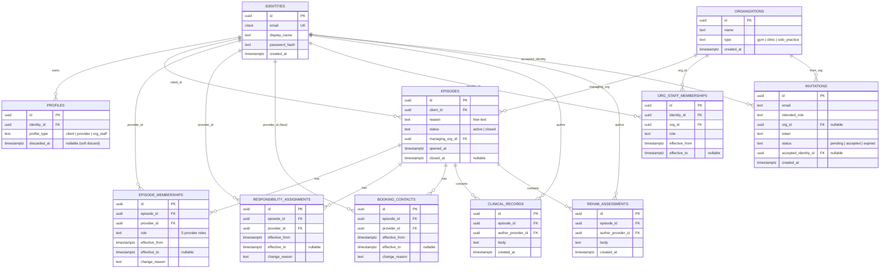

# Kinetic — Data Model (v1 implementation guide)

Concise ERD for what we actually build. **Not tables:** the 9 capabilities + the
role→capability grid live in `app/authz/` code; `BasicProfile`/`Schedule` are
stubbed client-scoped resources. **11 tables.**

All `*_id` columns that point at a person reference `IDENTITIES.id` (not `PROFILES`);
`provider_id` carries its role via `EPISODE_MEMBERSHIPS.role`. The four effective-dated,
append-only tables (`EPISODE_MEMBERSHIPS`, `RESPONSIBILITY_ASSIGNMENTS`,
`BOOKING_CONTACTS`, `ORG_STAFF_MEMBERSHIPS`) never overwrite — "current" = the row
effective at `now()`. `RESPONSIBILITY_ASSIGNMENTS` and `BOOKING_CONTACTS` (both per episode) carry a Postgres
`EXCLUDE … gist` no-overlap constraint (exactly one holder at any instant).

## Notes

- **Episode membership is the cross-org access boundary.** A provider can see/act on a
  client's episode only by being a current member of that episode — regardless of which
  org they belong to. There is no provider→org employment table in v1.
- **Managing org grants management only through `ORG_STAFF_MEMBERSHIPS`.** An episode's
  `managing_org_id` does not, by itself, give anyone access. `org_admin` capabilities
  (e.g. `MANAGE_TEAM`) come from holding an active `org_staff` membership (admin role) in
  that managing org.
- **Invitations are intentionally stubbed.** The brief asks us to decide how much
  onboarding to build, so `INVITATIONS` only covers token + status + creating the accepted
  `Identity`. It does **not** auto-create episode membership — that remains an explicit
  `Episode.add_member` step.
